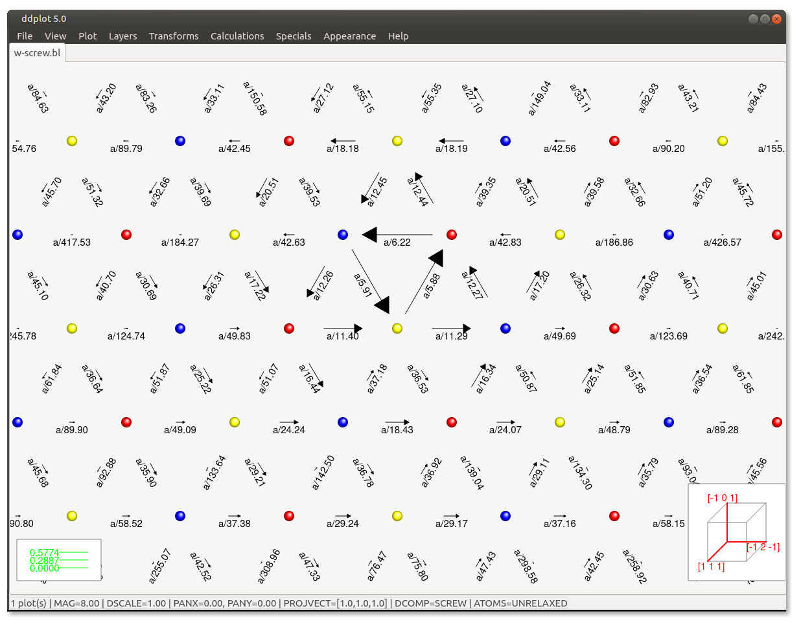
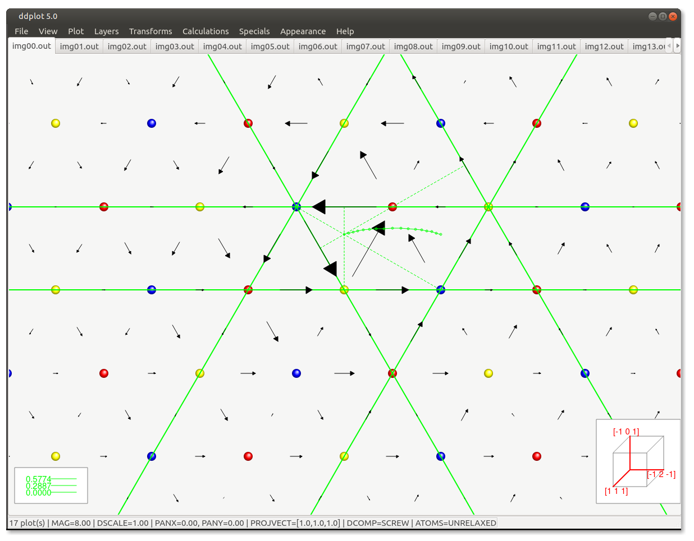

# ddplot

Visualization of distortions of crystals containing dislocations using the differential displacement maps. Both screw and edge view are implemented, comparison of two different distortions, geometrical transforms, user-defined styles. Imports data in a variety of formats, exports to Postscript, bitmap and internal .dd formats. The change in the separations of neighboring atoms is depicted by arrows whose lengths correspond to the magnitudes of the changes of their separation relative to their distance in the ideal crystal.

&nbsp;

The main features implemented in ddplot are: 
<ul>
  <li>plotting of atomic structure </li>
  <li>visualization of screw and edge components around a dislocation
    line</li>
  <li>projection of relative displacements into an arbitrary
    direction</li>
  <li>scaling of arrows (for the plotting of edge components)</li>
  <li>automatic finding of the first to fifth nearest neighbors</li>
  
  <li>unrelaxed/relaxed configuration</li>
  <li>coordinate transformations</li>
  <li>output to Postscript, .XYZ (JMol), standard .CFG (AtomEye)</li>
  <li>group loading of a set of plot files</li>
  <li>internal .DD format containing the coordinate system, position of the
    dislocation, lattice parameter, etc.</li>
  <li>creating a .GIF animation from the uploaded blocks</li>
  <li>changing colors, line thickness and radii of atoms and arrows</li>
  <li>distinguishing atomic layers or atomic types</li>
  <li>user-defined settings can be stored in ~/.ddplot or loaded at the start</li>
</ul>

<h2>Download & installation:</h2>

To compile ddplot, you first need to download the Qt library. If you are using Ubuntu/Debian, run this

<pre>
sudo apt install build-essential
sudo apt install qt5-default
</pre>

To install ddplot, clone the latest version using <tt>git</tt>, compile and run it as follows:
<pre>
git clone https://github.com/romangroger/ddplot.git ddplot
cd ddplot
qmake
make
./ddplot
</pre>

You should also copy (and edit) the settings file into your home directory:
<pre>
cp .ddplot ~/
</pre>

<h2>File formats</h2>

Following is a list of file formats that are readable by ddplot. If you want to use this code for
plotting, you are supposed to prepare your data in one of the supported formats. The only format
that ddplot uses for saving is the internal .dd format that whose complexity will evolve in future
releases to accommodate all possible information required for effective plotting of the differential
displacement maps. The <u>underlined words</u> are keywords and must appear as written below.

<h3>.xyz format</h3>

This is the most trivial format that does not contain any information about the
orientation of the block, periodicity and the like. It is entirely up to the user of
ddplot to remember these parameters.

<pre>
ninit                         # number of atoms in the initial structure

title_init
el1  x(1)  y(1)  z(1)
el2  x(2)  y(2)  z(2)
 :    :     :     :           # coordinates of atoms in the initial configuration
 :    :     :     :           # (usually unrelaxed ideal lattice)
eln  x(n)  y(n)  z(n)

nrel
title_rel
el1  x(1)  y(1)  z(1)
el2  x(2)  y(2)  z(2)
 :    :     :     :           # coordinates of atoms in the relaxed
 :    :     :     :           # configuration (relaxed structure)

eln  x(n)  y(n)  z(n)</tt> 
BVECT bx by bz                # Burgers vector of screw dislocation (if any)
</pre>

<h3>.plt format</h3>

This is an old format used in one of our simulation codes. Note, that the number
of atoms in the relaxed configuration should be identical to that in the perfect
lattice. The relaxed configuration is usually obtained by stressing a perfect
crystal, where the initial positions of atoms correspond to the perfect lattice.

<pre>
nrel                              # number of atoms in the relaxed configuration
z(1)         
z(2)
 :                                # z-positions of atoms in the relaxed
 :                                # configuration

z(nrel)
x(1)      y(1)    zlayer(1)
x(2)      y(2)    zlayer(2)
 :         :         :            # (x,y) positions of atoms in the
 :         :         :            # relaxed configuration
x(nrel)  y(nrel)  zlayer(nrel)

ninit                             # number of atoms in the perfect lattice
z(1)         
z(2)
 :                                # z-positions of atoms in the perfect lattice
 :
z(nrel)

x(1)        y(1)
x(2)        y(2)
 :           :                    # (x,y) positions of atoms in the perfect
 :           :                    # lattice
x(ninit)  y(ninit)
0                                 # unused, don't ask me why

xperiod
yperiod                           # periodicity in the x, y, z directions
zperiod
CORE xpos ypos                    # (x,y) position of the screw dislocation

If the block does not contain any screw dislocation, simply omit the last line.
</pre>

<h3>.bl format</h3>

This is another format from the same simulation code that we are using. The
format is a bit complicated and is not supposed to be used any more. It is left
in ddplot only for the sake of quick visualization of the results of our
simulations.

<pre>
LEN
  xlen  ylen  zlen                               # x, y and z size of the block
LATPAR
  latpar                                         # lattice parameter
ND
  nd                                             # number of active atoms
D
  x(1)   y(1)   z(1)   elem(1)

  x(2)   y(2)   z(2)   elem(2)                   # coordinates of active atoms in the
   :      :      :        :                      # relaxed configuration and the name
   :      :      :        :                      # of the element, e.g. Mo
  x(nd)  y(nd)  z(nd)  elem(nd) 
NINERT
  ninert                                         # number of inert atoms
DINERT
  x(1)       y(1)       z(1)       elem(1)
  x(2)       y(2)       z(2)       elem(2)       # coordinates of inert atoms in the

   :          :          :           :           # relaxed configuration and the name
   :          :          :           :           # of the element, e.g. Mo
  x(ninert)  y(ninert)  z(ninert)  elem(ninert) 
UNRLD
  x(1)       y(1)       z(1)       elem(1)

  x(2)       y(2)       z(2)       elem(2)       # coordinates of atoms in the
   :          :          :            :          # perfect lattice and the name
   :          :          :            :          # of the element, e.g. Mo
  x(nunrld)  y(nunrld)  z(nunrld)  elem(nunrld)  # nurld=nd+ninert
</pre>

In our simulations, the block is usually divided into two parts. Outer part of
the (x,y) plane contains inert atoms into which we apply anisotropic
displacements corresponding to a given stress field. The inner part then
contains active atoms whose position is obtained by minimization. In the relaxed
configuration, the force on each atom is essentially zero.

<h3>.dd format</h3>

This is the internal ddplot's format that contain all possible information about
the block, including the orientation of the block, positions of dislocations,
periodicity, etc. Each block starts with a header that is written below in
capital letters. Comments begin with '#' and are ignored by ddplot. Number of
spaces between each number in a row and between lines is arbitrary.

<pre>
CSYS                             # orientation of the block given by three
  x1  y1  z1                     # vectors defined in the cube coordinate system
  x2  y2  z2                     # [100], [010], [001]
  x3  y3  z3

PERIOD
  xperiod  yperiod  zperiod      # periodicity along x, y and z

DISLO_CENTER
  xpos  ypos                     # (x,y) position of the screw dislocation

NUM_UNREL
  ninit                          # number of atoms in the perfect lattice
  
COOR_UNREL
  x(1)      y(1)      z(1)      elem(1)
  x(2)      y(2)      z(2)      elem(2)       # coordinates of atoms in the
   :         :         :           :          # perfect lattice and the index
   :         :         :           :          # of the element of this atom
  x(ninit)  y(ninit)  z(ninit)  elem(ninit)   # (count from 0)

NUM_REL
  nrel                                        # number of atoms in the relaxed configuration

COOR_REL
  x(1)     y(1)     z(1)
  x(2)     y(2)     z(2)                      # coordinates of atoms in the relaxed
   :        :        :                        # configuration
   :        :        :       
  x(nrel)  y(nrel)  z(nrel)
</pre>

The mandatory fields are <tt>NUM_UNREL</tt>, <tt>COOR_UNREL</tt>, <tt>NUM_REL</tt>,
<tt>COOR_REL</tt>, and <tt>PERIOD</tt>.

<h2>Web site & citations:</h2>

The main website of the <tt>ddplot</tt> project is <tt>http://groger.ipm.cz/download/ddplot.html</tt>. 
Roman Gr&ouml;ger (<A HREF="mailto:groger@ipm.cz">groger@ipm.cz</A>)  

To keep you updated about new versions of ddplot, send me your e-mail and I will add you into the
ddplot mailing list. I will be glad to hear about your experience with ddplot, your suggestions but
also criticism. If you have some nice figures from ddplot, please, send me .JPG or .GIF to put them
here as screenshots.
